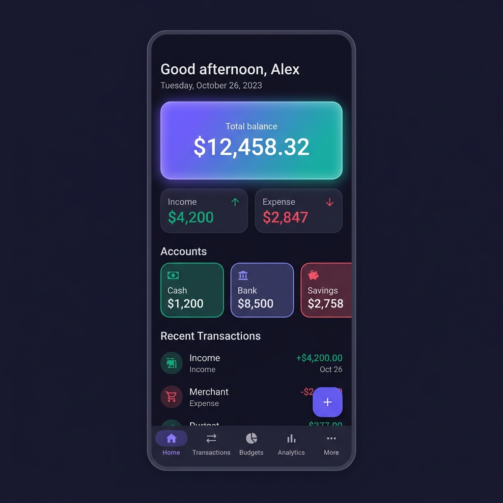
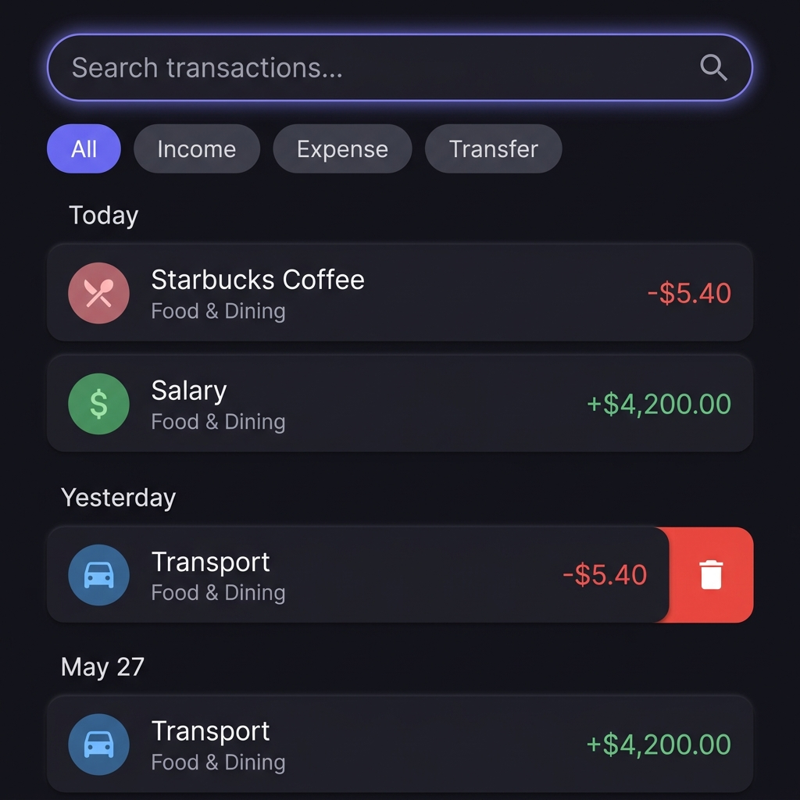
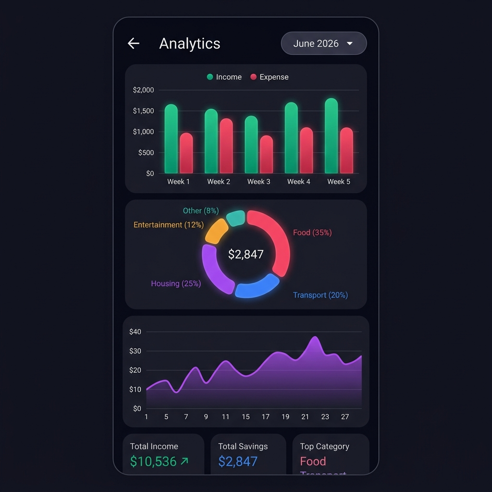
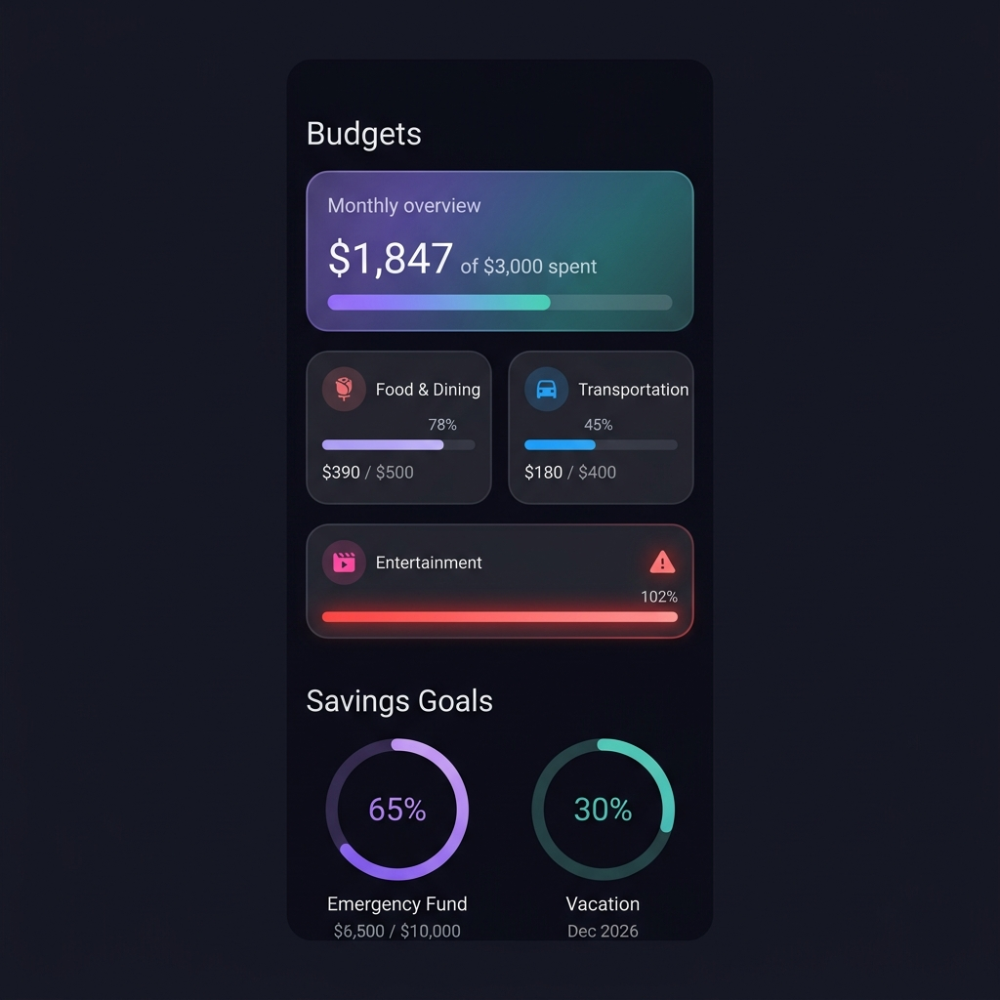

<div align="center">

# 💰 FinTrack

### Personal Finance & Budget Tracker

A modern, feature-rich Android app built with Kotlin & Jetpack Compose

[](https://github.com/abdelkafi007/fintrack/actions/workflows/android-ci.yml)
[](https://kotlinlang.org)
[](https://developer.android.com/compose)
[](https://android-arsenal.com/api?level=26)
[](LICENSE)

<br/>

 &nbsp;&nbsp;
 &nbsp;&nbsp;
 &nbsp;&nbsp;


</div>

---

## ✨ Features

<table>
<tr>
<td>

**💳 Transaction Tracking**
- Add income, expenses & transfers
- Category tagging with color coding
- Search & filter by type
- Swipe-to-delete with undo

</td>
<td>

**📊 Analytics & Reports**
- Income vs Expense comparison
- Category breakdown with percentages
- Daily spending trend charts
- Net cash flow indicator

</td>
</tr>
<tr>
<td>

**💰 Budget Management**
- Monthly/weekly budgets per category
- Real-time progress tracking
- Over-budget visual warnings
- Rollover support

</td>
<td>

**🎯 Savings Goals**
- Set targets with deadlines
- Circular progress visualization
- Fund allocation tracking
- Completion celebration

</td>
</tr>
<tr>
<td>

**🏦 Multi-Account**
- Cash, Bank, Credit Card, Savings
- Per-account balance tracking
- Net worth calculation
- Account-to-account transfers

</td>
<td>

**🎨 Premium UI/UX**
- Material Design 3
- Dynamic color (Android 12+)
- Dark mode support
- Smooth animations throughout

</td>
</tr>
</table>

---

## 🏗️ Architecture

The app follows **Clean Architecture** with **MVVM** pattern for clear separation of concerns:

```
┌──────────────────────────────────────────────┐
│              Presentation Layer              │
│  ┌─────────┐  ┌───────────┐  ┌───────────┐  │
│  │ Screens │──│ ViewModels│──│ UI State  │  │
│  │(Compose)│  │  (Hilt)   │  │(StateFlow)│  │
│  └─────────┘  └───────────┘  └───────────┘  │
├──────────────────────────────────────────────┤
│                Domain Layer                  │
│  ┌──────────┐  ┌────────────┐               │
│  │ Use Cases│  │ Repository │               │
│  │(Business)│  │ Interfaces │               │
│  └──────────┘  └────────────┘               │
├──────────────────────────────────────────────┤
│                 Data Layer                   │
│  ┌──────┐  ┌──────┐  ┌──────┐  ┌─────────┐ │
│  │ Room │──│ DAOs │──│Mapper│──│  Repo   │ │
│  │  DB  │  │      │  │      │  │  Impls  │ │
│  └──────┘  └──────┘  └──────┘  └─────────┘ │
└──────────────────────────────────────────────┘
```

---

## 🛠️ Tech Stack

| Layer | Technology |
|:------|:-----------|
| **Language** | Kotlin 2.1 |
| **UI Framework** | Jetpack Compose + Material Design 3 |
| **Architecture** | Clean Architecture + MVVM |
| **Dependency Injection** | Hilt (Dagger) |
| **Database** | Room with Flow queries |
| **Async** | Kotlin Coroutines + StateFlow |
| **Navigation** | Navigation Compose with animated transitions |
| **Typography** | Google Fonts (Outfit + Inter) |
| **Build System** | Gradle 8.9 + Version Catalog |
| **CI/CD** | GitHub Actions |
| **Min SDK** | API 26 (Android 8.0) |

---

## 🚀 Getting Started

### Prerequisites

- **Android Studio** Hedgehog (2023.1.1) or newer
- **JDK 17**
- **Android SDK 35**

### Clone & Build

```bash
# Clone the repository
git clone https://github.com/abdelkafi007/fintrack.git
cd fintrack

# Build debug APK
./gradlew assembleDebug

# Install on connected device
./gradlew installDebug
```

### Run in Android Studio

1. Open Android Studio
2. Select **File → Open** and choose the `fintrack` directory
3. Wait for Gradle sync to complete
4. Click **Run ▶** or press `Shift + F10`

---

## 📁 Project Structure

```
app/src/main/java/com/fintrack/
├── 📱 FinTrackApplication.kt          # Hilt Application
├── 📱 MainActivity.kt                 # Single Activity entry point
│
├── 🧩 core/
│   ├── di/                             # Hilt modules (Database, Repository)
│   └── utils/                          # CurrencyFormatter, DateFormatter
│
├── 💾 data/
│   ├── local/
│   │   ├── converter/                  # Room TypeConverters
│   │   ├── dao/                        # 5 DAOs with Flow queries
│   │   └── entity/                     # 7 Room entities
│   ├── mapper/                         # Entity ↔ Domain mappers
│   └── repository/                     # 6 Repository implementations
│
├── 🏛️ domain/
│   ├── model/                          # Pure Kotlin domain models
│   ├── repository/                     # Repository interfaces
│   └── usecase/                        # 25+ use cases
│
└── 🎨 presentation/
    ├── navigation/                     # Screen routes + NavGraph
    ├── ui/
    │   ├── theme/                      # Colors, Typography, MD3 Theme
    │   ├── components/                 # Reusable composables
    │   ├── home/                       # Dashboard
    │   ├── transactions/               # Transaction list + add/edit
    │   ├── budgets/                    # Budget management
    │   ├── accounts/                   # Account management
    │   ├── goals/                      # Savings goals
    │   ├── analytics/                  # Charts & reports
    │   ├── settings/                   # App settings
    │   └── FinTrackApp.kt              # Root composable
    └── viewmodel/                      # 12 ViewModels
```

---

## 🔑 Design Decisions

| Decision | Rationale |
|:---------|:----------|
| **Offline-first** | All data in Room DB — no internet needed |
| **Flow-based queries** | Reactive UI updates when data changes |
| **Use case pattern** | Single-responsibility business logic |
| **Animated UI** | Counters, progress bars, transitions for premium feel |
| **Semantic colors** | 🟢 Green = income, 🔴 Red = expense, 🔵 Blue = transfer |
| **Dynamic colors** | Adapts to wallpaper on Android 12+ |

---

## 🗺️ Roadmap

- [ ] 🔐 Biometric / PIN lock
- [ ] 🔒 SQLCipher encrypted database
- [ ] 📱 Home screen widget (Glance API)
- [ ] 📤 CSV / PDF export
- [ ] 🔔 Budget alert notifications
- [ ] 🌐 Multi-currency support
- [ ] 👋 Onboarding wizard
- [ ] ✅ Unit & UI test suite

---

## 🤝 Contributing

Contributions are welcome! Feel free to:

1. Fork the repository
2. Create a feature branch (`git checkout -b feature/amazing-feature`)
3. Commit your changes (`git commit -m 'Add amazing feature'`)
4. Push to the branch (`git push origin feature/amazing-feature`)
5. Open a Pull Request

---

## 📄 License

This project is licensed under the MIT License — see the [LICENSE](LICENSE) file for details.

---

<div align="center">

**Built with ❤️ using Kotlin & Jetpack Compose**

⭐ Star this repo if you find it useful!

</div>
